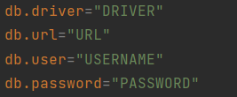

# 🎥 Cinema App 🎥

### 📙 Project description: 

Web stateless app that supports user authentication, authorization, and CRUD operations with app entities built using Spring and Hibernate frameworks. Allows users to send HTTP requests by endpoints(GET, POST, PUT, DELETE) depending on their role.

### 🎯 Features:
Application users can have USER or ADMIN roles. USER role assigns automatically to every newly registered user.
Below you can observe a list of all endpoints in the app. Each endpoint is presented in the format: http request method, endpoint, role required for access, description.
- POST: /register - (all) - register a new user.
- GET: /cinema-halls - (user/admin) - get all cinema halls.
- POST: /cinema-halls - (admin) - add new cinema hall.
- GET: /movies - (user/admin) - get all the movies in the cinema.
- POST: /movies - (admin) - add new movie to cinema.
- GET: /movie-sessions/available - (user/admin) - get available movies sessions by date.
- POST: /movie-sessions - (admin) - add new movie session.
- PUT: /movie-sessions/{id} - (admin) - update movie session.
- DELETE: /movie-sessions/{id} - (admin) - delete movie session.
- GET: /orders - (user) - get list of orders for user.
- POST: /orders/complete - (user) - complete order and clear user`s shopping cart.
- PUT: /shopping-carts/movie-sessions - (user) - creates ticket for movies session and adds it to current user`s shopping cart.
- GET: /shopping-carts/by-user - (user) - get shopping cart of current user. 
- GET: /users/by-email - (admin) - get user by email.

### 📄 Entity-Relationship diagram
This is a diagram of the application provided to help you understand how it works:

### 🌐👨🏻‍💻 Technologies
⚪ Java 17  
⚪ Spring Web MVC, Spring Security, Hibernate  
⚪ MySQL 8.0, Tomcat 9.0.76, Maven  

### 🧱 Project structure:
#### java/
⚪ config - config classes required by Spring, Hibernate  
⚪ controller - http controllers  
⚪ dao - classes for CRUD operation with database  
⚪ dto - classes for providing information in http requests and responses  
⚪ exception - custom exceptions  
⚪ lib - custom validators for email and password confirmation  
⚪ model - entity classes used in the application  
⚪ service - classes that provide business logic  
⚪ util - utility classes  

#### resources/
⚪ db.properties - contains database configuration  

#### other/

⚪ pom.xml - contains maven configuration  
⚪ checkstyle.xml - contains checkstyle rules  

### 💻 🛠️ Setting up
1. Install JDK 17, Tomcat 9.0.50, MySQL, Tomcat
2. Clone the repository to local device
3. Add Your database configuration to `resources/db.properties` file  
   
4. Configure Tomcat  
   
5. Build and run the app
6. You can use email "admin@i.ua" and password "admin123" fot authentication as Admin or register new user
7. You can test endpoints in Postman
